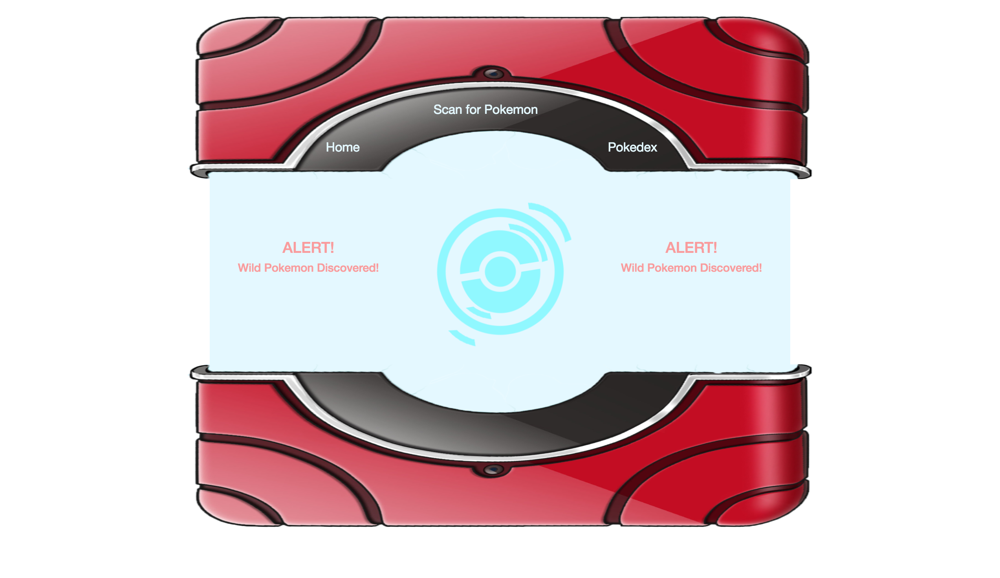
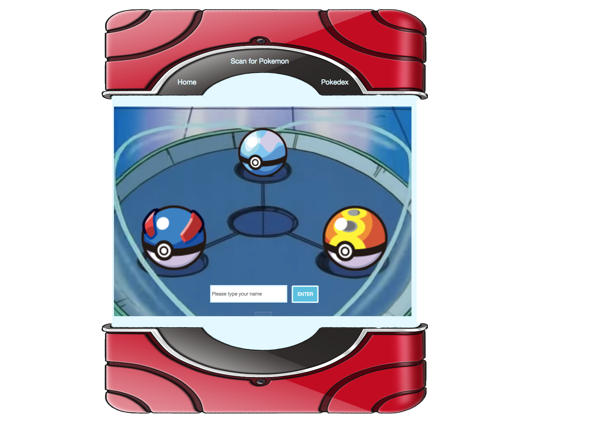
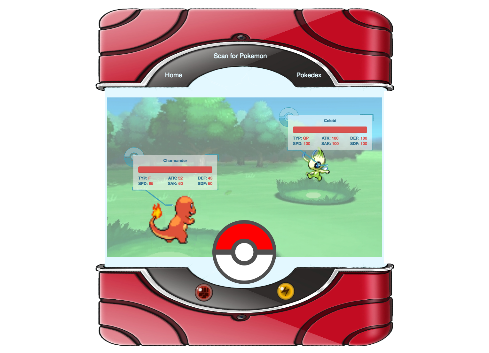
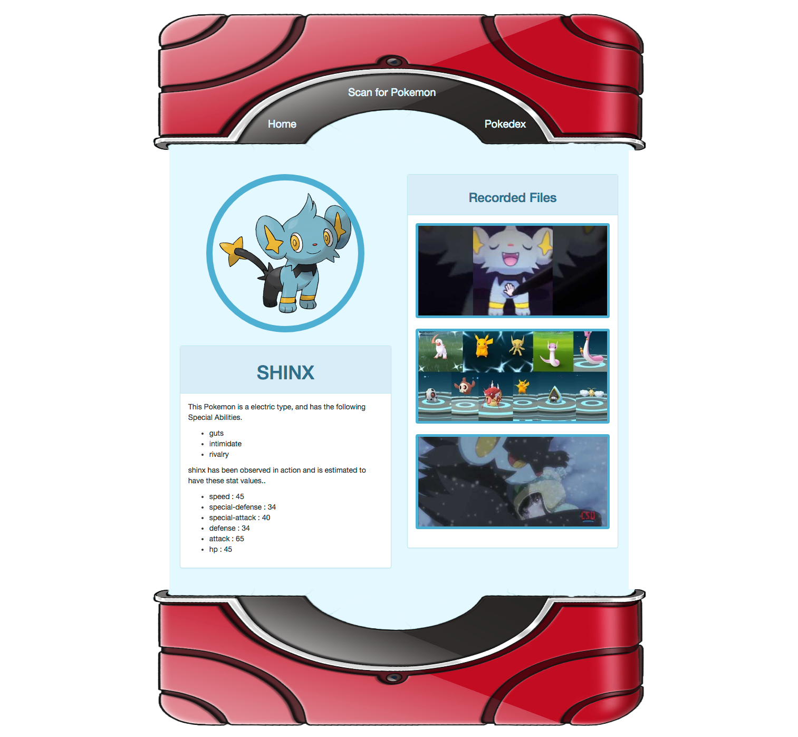

# Pokédex-N

Pokédex-N is a server-less, mobile-ready, AngularJS powered interactive recreation of the fictional Pokédex device found in the Pokémon series. Check out the [hosted demo](https://pokedex-n.herokuapp.com/).

## Features!
  - Type your name and listen to the Pokedéx use text to speech api to greet and instruct you.
  - Choose a Pokéball and a random starter Pokémon buddy is generated for you.
  - An encounter event is triggered and a call to PokeApi creates the wild Pokémon
  - Use the Pokéball button to launch an animated Pokéball.
  - Capture page shows all the details of the captured Pokémon. Click the description to hear what the Pokedéx has to say.

